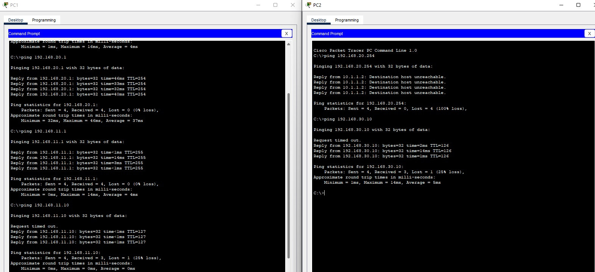

# ACLs-padrao-numerica
Projeto demonstrando configuração de ACLs padrão numerica em roteadores Cisco.

## Tipos de ACLs

- **ACL Padrão**: Filtra por IP de origem.
- **ACL Estendida**: Filtra por IP de origem/destino, protocolo e porta.

## Exemplo de Configuração

```cli
R2(config)#access
R2(config)#access-list 1 den
R2(config)#access-list 1 deny 192.168.11.0 0.0.0.255
R2(config)#access-list 1 per
R2(config)#access-list 1 permit an
R2(config)#access-list 1 permit any 
R2(config)#do sh access-list 1
Standard IP access list 1
    deny 192.168.11.0 0.0.0.255
    permit any

R3(config)#access-list 1 den
R3(config)#access-list 1 deny 192.168.10.0 0.0.0.255
R3(config)#acc
R3(config)#access-list per
R3(config)#access-list permi
R3(config)#access-list 1 per
R3(config)#access-list 1 permit an
R3(config)#access-list 1 permit any 
R3(config)#do sh access list 1
sh access list 1

🧪 Simulação
Configuração realizada no Cisco Packet Tracer com os seguintes dispositivos:

Roteador Cisco 2911

Switches Cisco 2960

👨‍💻 Autor
Ivo dos Santos Correia Certificações: CCNA 1, CCNA 2, CCNA 3, Google IT Support


🖼️ Imagens (Opcional)




